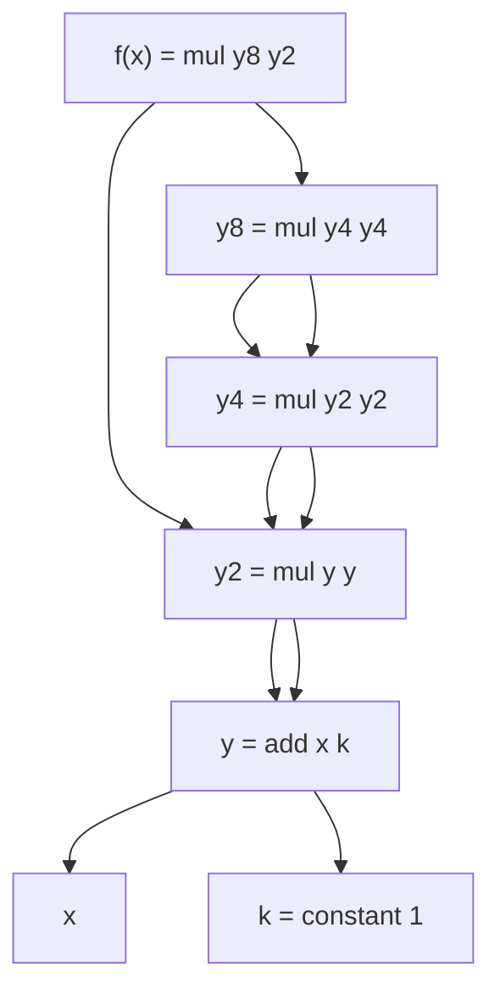
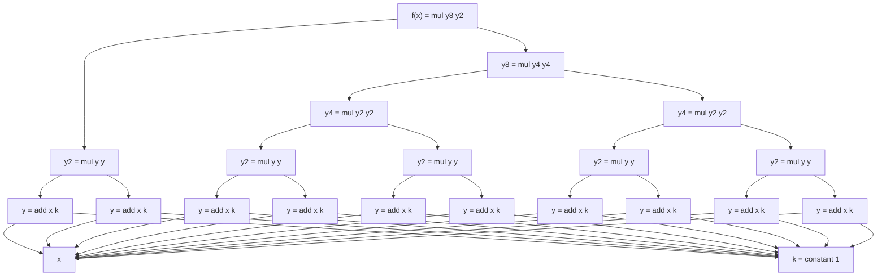

普通のプログラミング言語は、典型的には逐次実行、条件分岐、繰り返しなどの制御構造を持ち、数値に対しては四則演算などの計算ができます。ある機能を提供するライブラリーは、これらの構造・計算規則に従いつつ、データ型や関数によって機能を提供します。

これに対し、用途によっては「計算の仕組み」そのものをカスタマイズしたいことがあります。例えば、最近の言語で見かけるasync/awaitは、逐次実行に見せかけて「await後の計算」をキャプチャーし、結果が得られたタイミングで呼び出せるようにする必要があります。別の例として、通常の計算ではプログラム中の変数に束縛される値は一通りですが、非決定的計算では一つの変数に対して複数の候補を保持できる必要があります。あるいは、GPUで計算するフレームワークでは、計算をCPU上ではなくGPU上で行うために、計算内容をデータとして取得できる必要があります。

こういう「風変わりな計算の仕組み」を実現する言語は、**ドメイン特化言語** (domain specific language; DSL) と呼ばれるかもしれません。ドメイン特化言語を作る際に、一からパーサーやら何やらを実装すると大変なので、既存の言語に埋め込む形で実現されることがあります。そのようなドメイン特化言語を、**EDSL** (embedded DSL) と呼びます。

HaskellはEDSLを作るのに適した言語です。例えば、**モナド**は強力な仕組みであり、非決定的計算を実現できます。parsecを始めとするパーサーコンビネーターもモナドとして使えます。

この記事では、HaskellでEDSLを作る**モナド以外の**テクニックを紹介します。

そういうテクニックはいくつかありますが、今回は、`unsafePerformIO` と `atomicModifyIORef'` を使う例を紹介します。

## 題材：自動微分

この記事では自動微分を題材とするので、ざっくりと自動微分の説明をします。題材として使いたいだけなので、駆け足で説明します。

ある関数を実装する際に、その導関数も一緒に欲しいことがたまにあります。例えば、CGの方の応用では、曲線を表す関数と一緒に接線も欲しいかもしれません。別の例として、ディープラーニングではモデルを学習させるために、（確率的）勾配降下法を使いますが、そこではモデルを含む関数の勾配が必要になります。

導関数を得る方法はいくつかあります。「$(x+1)^{10}$を微分しろ」と言われたら、人間だったら数式として微分するのではないでしょうか。計算機で数式処理のようなことを行えば、与えられた関数の導関数を機械的に得ることは可能でしょう。

しかし、プログラムとして書かれた関数を数式で表すのは必ずしも容易ではありません。例えば、条件分岐が何段にも重なっていたら厄介です。

微分の近似値を数値的に得る方法（数値微分）もあります。つまり、小さいが0ではない$h$に対し、$(f(x+h)-f(x))/h$（あるいは$(f(x+h/2)-f(x-h/2))/h$）を計算するのです。この方法はプログラムが複雑でも対応できます。デメリットしては、浮動小数点演算を使うことによる誤差に加えて、微分を差分で近似することによる誤差も考慮する必要が出てきます。また、関数の実行回数が増えることもデメリットで、変数の個数が増えると大変です。

数値微分の例を載せておきます。

```
ghci> f x = (x + 1)^10
ghci> f' x = (f (x + 1e-9) - f x) / 1e-9
ghci> f' 1 :: Double
5120.0004236306995
```

これらに対して、

* 複雑なプログラムに対しても機械的に適用できて
* 数式微分のように正確な結果が得られる（差分近似に起因する誤差を持たない）

手法があり、**自動微分** (automatic differentiation) と呼ばれています。

自動微分にはいくつかの実装方式があります。代表的なものは**フォワードモード**と**リバースモード**です。いずれも「複雑な関数も基本的な演算（四則演算や初等関数）の組み合わせに還元でき、基本的な演算の微分は既知である」という考えに基づき、「微分が既知な関数の組み合わせで複雑な関数の微分を組み立て」ます。

### フォワードモード

フォワードモードでは、計算の際に、変数の値 `x` に加えて微分係数 `xt` を保持します。自動微分界隈では「元の値」はprimal、微分係数はtangentあるいはperturbationと呼ばれます。

フォワードモードで基本的な演算（四則演算や初等関数）がどう置き換えられるか見てみましょう。`f :: Double -> Double` や `g :: Double -> Double -> Double` という関数（あるいは演算子）は

```haskell
df :: (Double, Double) -> (Double, Double)
df (x, xt) = (f x, f' x * xt)
-- f' は f の導関数

dg :: (Double, Double) -> (Double, Double) -> (Double, Double)
dg (x, xt) (y, yt) = (g x y, g_x x y * xt + g_y x y * yt)
-- g_x は g の x に関する偏導関数
-- g_y は g の y に関する偏導関数
```

という関数へ変換します。そして、`f` や `g` を使って組み立てられる関数は、代わりに `df` や `dg` を使うようにします。

動くコード例を載せます。

```haskell
type Forward a = (a, a) -- primal, tangent

constant :: Double -> Forward Double
constant x = (x, 0)

add :: Forward Double -> Forward Double -> Forward Double
add (x, xt) (y, yt) = (x + y, xt + yt)

mul :: Forward Double -> Forward Double -> Forward Double
mul (x, xt) (y, yt) = (x * y, x * yt + y * xt)

f :: Forward Double -> Forward Double
f x = let y = add x (constant 1)
          y2 = mul y y
          y4 = mul y2 y2
          y8 = mul y4 y4
      in mul y8 y2

f' :: Double -> Double
f' x = snd (f (x, 1))
```

```
ghci> f' 1 :: Double
5120.0
```

導関数の正確な値を、誤差なく計算できました。もちろん、結果を浮動小数点数で正確に表現できない場合はそれに由来する誤差が出ます。

Haskellでフォワードモードをやるには、普通に直積のようなデータ型を定義して各種演算子をオーバーロード（型クラスのインスタンスの実装）してやれば良いです。例えば、adパッケージに実装があります。

* [Numeric.AD.Rank1.Forward](https://hackage.haskell.org/package/ad-4.5.6/docs/Numeric-AD-Rank1-Forward.html)

フォワードモードは、入力の変数の数に対して出力の変数の数が少ない場合に効果的であるとされています。ディープラーニングでは入力（モデルのパラメーター）の数が出力（変数一個）に対して圧倒的に大きいので、通常はフォワードモードではなく次に述べるリバースモードが使われます。

### リバースモード

フォワードモードは、関数の合成

```haskell
y = j . i . h . g . f $ x
```

があったときに、それぞれの関数をその微分に置き換え、入力に近い方から計算していく方式

```haskell
(y, yt) = dj (di (dh (dg (df (x, xt)))))
```

と考えられます。普通ですね。

ところで、3個以上の行列の積は、どの組み合わせを先に計算するかによって計算量が変わる場合があるのをご存知でしょうか？つまり、

$$
A(BC)
$$

と

$$
(AB)C
$$

では一般には計算量が違う、ということです。

微分は線形近似なので関数の導関数を掛けることは行列（ヤコビ行列）の掛け算と捉えることができ、すると関数の微分の合成も組み合わせによって計算量が違うかもしれない、ということになります。

つまり、先ほどの関数の合成を

```haskell
(((dj . di) . dh) . dg) . df
```

とすれば効率的な場合があるのではないか？ということです。

もちろん、「元の値」primalは元の順序で計算しないといけませんが、微分係数（sensitivityと呼ばれる）は出口の方から計算していきます。

「基本的な演算」 `f :: a -> b` や `g :: a -> b -> c` に対して、対応する「導関数を掛ける関数を返す関数」を関数名にアンダースコアをつけて

```haskell
f_ :: a -> (b, b -> a)
f_ x = (f x, \ys -> ys * f' x)
-- f' は f の導関数

g_ :: a -> b -> (c, c -> (a, b))
g_ x y = (g x y, \zs -> (zs * g_x x y, zs * g_y x y))
-- g_x は x に関する偏導関数
-- g_y は y に関する偏導関数
```

とします。

複雑な関数合成 `j . i . h . g . f` の微分は

```haskell
d x = let (x1, f') = f_ x
          (x2, g') = g_ x1
          (x3, h') = h_ x2
          (x4, i') = i_ x3
          (y, j') = j_ x4
          ys = 1
          x4s = j' ys
          x3s = i' x4s
          x2s = h' x3s
          x1s = g' x2s
          xs = f' x1s
      in (y, xs)
```

と計算できます。微分係数の計算が逆順になるので「リバース」というわけです。

$(x+1)^{10}$ の例を実装すると次のようになります：

```haskell
add :: Double -> Double -> (Double, Double -> (Double, Double))
add x y = (x + y, \s -> (s, s))

mul :: Double -> Double -> (Double, Double -> (Double, Double))
mul x y = (x * y, \s -> (y * s, x * s))

f' :: Double -> Double
f' x = let (y, y') = add x 1
           (y2, y2') = mul y y
           (y4, y4') = mul y2 y2
           (y8, y8') = mul y4 y4
           (z, z') = mul y8 y2
           zs = 1
           (y8s, y2s0) = z' zs
           (y4s0, y4s1) = y8' y8s
           y4s = y4s0 + y4s1 -- 複数回使った変数はsensitivityを足し合わせる
           (y2s1, y2s2) = y4' y4s
           y2s = y2s0 + y2s1 + y2s2
           (ys0, ys1) = y2' y2s
           ys = ys0 + ys1
           (xs, _) = y' ys
       in xs
```

実行結果は次のようになります：

```
ghci> f' 1
5120.0
```

まあ、理屈がすぐにわからなくても気に病む必要はありません。この記事は自動微分の丁寧な解説ではないからです。ただ「リバースモード自動微分は評価の順番を逆転させる必要があって大変そうだ」ということがわかれば大丈夫です。

実装例では手動で評価の順番を逆転させました。しかし、正直なところ「リバースモード自動微分も普通の演算子オーバーロードで書けてほしい」というのが本音ではないでしょうか。

この記事では、リバースモード自動微分を演算子オーバーロードで書くためのテクニックを紹介します。

## Wengert listとSTモナドを使ったリバースモード自動微分の実装

発想としては、順方向の計算では計算手順（実際に必要なのは導関数の計算方法）をリストなどのデータ構造（Wengert listやtapeと呼ばれる）に保管しておいて、導関数を計算したくなったときに逆順に再生します。

Haskellでの実装例を以下に載せます。計算手順はリストの `STRef` に溜めておきます。

```haskell
{- cabal:
build-depends: base, vector, mtl
-}
{-# LANGUAGE GADTs #-}
{-# LANGUAGE RankNTypes #-}
import Data.STRef
import qualified Data.Vector.Unboxed.Mutable as VM
import Control.Monad
import Control.Monad.Reader
import Control.Monad.ST

-- 基本的な演算
data Node where
  InputNode :: Node
  UnaryNode :: Maybe Int -> (Double -> Double) -> Node
  BinaryNode :: Maybe Int -> Maybe Int -> (Double -> (Double, Double)) -> Node

-- 計算に使った「基本的な演算」のリスト
data Tape = Tape { currentLength :: Int, reversedNodes :: [Node] }

-- 順方向の計算に使うモナド
type M s = ReaderT (STRef s Tape) (ST s)

-- 順方向の計算に使うデータ型
data Reverse a = Reverse { primal :: a, sensitivityIndex :: Maybe Int }

addNode :: Node -> M s Int
addNode n = do
  r <- ask
  Tape i ns <- lift $ readSTRef r
  lift $ writeSTRef r (Tape (i + 1) (n : ns))
  pure i

run :: (forall s. Reverse Double -> M s (Reverse Double)) -> (Double -> (Double, Double -> Double))
run f x = runST $ do
  r <- newSTRef (Tape 0 [])
  let action = do
        i <- addNode InputNode
        f (Reverse x (Just i))
  Reverse y ys <- runReaderT action r
  case ys of
    Nothing -> pure (y, \_ys -> 0)
    Just yi -> do
      Tape m revNodes <- readSTRef r
      let fs ys = runST $ do
            -- テープを逆順に再生して微分を計算する
            v <- VM.replicate m (0 :: Double)
            VM.write v yi ys
            forM_ (zip [m-1,m-2..] revNodes) $ \(i,n) ->
              case n of
                InputNode -> pure ()
                UnaryNode (Just j) gs -> do
                  s <- VM.read v i
                  VM.modify v (+ gs s) j
                BinaryNode j k gs -> do
                  s <- VM.read v i
                  let (sj, sk) = gs s
                  maybe (pure ()) (VM.modify v (+ sj)) j
                  maybe (pure ()) (VM.modify v (+ sk)) k
            VM.read v 0
      pure (y, fs)

constant :: a -> M s (Reverse a)
constant x = pure $ Reverse x Nothing

add :: Reverse Double -> Reverse Double -> M s (Reverse Double)
add (Reverse x i) (Reverse y j) = do
  k <- addNode (BinaryNode i j (\s -> (s, s)))
  pure $ Reverse (x + y) (Just k)

mul :: Reverse Double -> Reverse Double -> M s (Reverse Double)
mul (Reverse x i) (Reverse y j) = do
  k <- addNode (BinaryNode i j (\s -> (y * s, x * s)))
  pure $ Reverse (x * y) (Just k)

f_ :: Reverse Double -> M s (Reverse Double)
f_ x = do
  k <- constant 1
  y <- add x k
  y2 <- mul y y
  y4 <- mul y2 y2
  y8 <- mul y4 y4
  mul y8 y2

f' :: Double -> (Double, Double -> Double)
f' = run f_

main :: IO ()
main = do
  let (y, ys) = f' 1
  print (ys 1)
```

このプログラムを実行すると `5120.0` が出力され、正しく導関数の値が計算できていそうだとわかります。

実装をよく見ると、いくつかの点がわかります（逆に言うとこれらの点がわかれば十分で、アルゴリズムの理解はこの記事には必要ではありません）：

* 順方向の計算でモナドを使っている。
    * 「計算手順のリスト」をSTモナドで更新するため。
    * このリストは `ReaderT` で共有されており、グローバル変数に近い。
* 導関数の計算（逆方向）でもSTモナドを使っているが、これは局所的な利用で済む。
    * 導関数自体は純粋な関数 `Double -> Double` として得られる。
* 諸事情により要素の型は `Double` しか使えない。
    * 任意の `Num` インスタンスに対応させようとすると `unsafeCoerce` か `Typeable` の使用が必要になり、煩雑なので、ここでは `Double` に限定することで簡略化しました。

この中で一番厄介なのは、「順方向の計算でモナドを使っている」という点です。`Num` クラスの演算子は `(+) :: Num a => a -> a -> a` という純粋な関数として定義されているので、このままでは `Reverse a` 型は `Num` クラスのインスタンスにはできません。

## `unsafePerformIO` を使う

内部的に副作用を使う計算を純粋な計算に見せかけるには何を使えばいいでしょうか？そう、`unsafePerformIO` ですね。

このほか、グローバル変数の使用で `ReaderT` モナドを使っていますが、これはreflectionパッケージを使うことで代用します。

* [reflection: Reifies arbitrary terms into types that can be reflected back into terms](https://hackage.haskell.org/package/reflection)

というわけで、これらを使って順方向の計算から見た目上モナドを消去したプログラムが以下になります：

```haskell
{- cabal:
build-depends: base, vector, mtl, reflection
-}
{-# LANGUAGE GHC2021 #-}
{-# LANGUAGE DataKinds #-}
{-# LANGUAGE GADTs #-}
{-# LANGUAGE RankNTypes #-}
import Data.Kind
import Data.Reflection
import Data.IORef
import Data.Proxy
import qualified Data.Vector.Unboxed.Mutable as VM
import Control.Monad
import Control.Monad.Reader
import Control.Monad.ST
import System.IO.Unsafe

-- 基本的な演算
data Node where
  InputNode :: Node
  UnaryNode :: Maybe Int -> (Double -> Double) -> Node
  BinaryNode :: Maybe Int -> Maybe Int -> (Double -> (Double, Double)) -> Node

-- 計算に使った「基本的な演算」のリスト
data Tape = Tape { currentLength :: Int, reversedNodes :: [Node] }

type M = ReaderT (IORef Tape) IO

-- 順方向の計算に使うデータ型
type Reverse :: Type -> Type -> Type
data Reverse s a = Reverse { primal :: !a, sensitivityIndex :: !(Maybe Int) }

addNode :: Node -> M Int
addNode n = do
  r <- ask
  Tape i ns <- lift $ readIORef r
  lift $ writeIORef r (Tape (i + 1) (n : ns))
  pure i

runNode :: forall a s. Reifies s (IORef Tape) => M (Reverse s a) -> Reverse s a
runNode action = let r = reflect (Proxy :: Proxy s)
                 in unsafePerformIO (runReaderT action r)

run :: (forall s. Reifies s (IORef Tape) => Reverse s Double -> Reverse s Double) -> (Double -> (Double, Double -> Double))
run f x = unsafePerformIO $ do
  r <- newIORef (Tape 0 [])
  let action = do
        i <- addNode InputNode
        pure $! reify r $ \(proxy :: Proxy s) -> case f (Reverse x (Just i) :: Reverse s Double) of
          Reverse y ys -> (y, ys)
  (!y, ys) <- runReaderT action r
  case ys of
    Nothing -> pure (y, \_ys -> 0)
    Just yi -> do
      Tape m revNodes <- readIORef r
      let fs ys = runST $ do
            -- テープを逆順に再生して微分を計算する
            v <- VM.replicate m (0 :: Double)
            VM.write v yi ys
            forM_ (zip [m-1,m-2..] revNodes) $ \(i,n) ->
              case n of
                InputNode -> pure ()
                UnaryNode (Just j) gs -> do
                  s <- VM.read v i
                  VM.modify v (+ gs s) j
                BinaryNode j k gs -> do
                  s <- VM.read v i
                  let (sj, sk) = gs s
                  maybe (pure ()) (VM.modify v (+ sj)) j
                  maybe (pure ()) (VM.modify v (+ sk)) k
            VM.read v 0
      pure (y, fs)

constant :: a -> Reverse s a
constant x = Reverse x Nothing

add :: Reifies s (IORef Tape) => Reverse s Double -> Reverse s Double -> Reverse s Double
add (Reverse x i) (Reverse y j) = runNode $ do
  k <- addNode (BinaryNode i j (\s -> (s, s)))
  pure $ Reverse (x + y) (Just k)

mul :: Reifies s (IORef Tape) => Reverse s Double -> Reverse s Double -> Reverse s Double
mul (Reverse x i) (Reverse y j) = runNode $ do
  k <- addNode (BinaryNode i j (\s -> (y * s, x * s)))
  pure $ Reverse (x * y) (Just k)

-- 純粋な関数として書けている
f_ :: Reifies s (IORef Tape) => Reverse s Double -> Reverse s Double
f_ x = let y = add x (constant 1)
           y2 = mul y y
           y4 = mul y2 y2
           y8 = mul y4 y4
       in mul y8 y2

f' :: Double -> (Double, Double -> Double)
f' = run f_

main :: IO ()
main = do
  let (y, ys) = f' 1
  print (ys 1)
```

## `unsafePerformIO` と並列処理

Haskellは並列処理もできます。Haskellの純粋な計算は、並列に評価しても同じ結果を返すべきです。先ほど書いたリバースモード自動微分はどうでしょうか。先ほどのコードを少し変えて、

$$
\sum_{k=0}^{100} x^k
$$

の微分を $x=1$ で評価するプログラムを書いてみます。これは $0+1+2+\dots+100$ なので、5050を返すべきです。

```haskell
{- cabal:
build-depends: base, vector, mtl, reflection, parallel
ghc-options: -threaded -rtsopts -with-rtsopts=-N8
-}
{-# LANGUAGE GHC2021 #-}
{-# LANGUAGE DataKinds #-}
{-# LANGUAGE GADTs #-}
{-# LANGUAGE RankNTypes #-}
import Data.Kind
import Data.Reflection
import Data.IORef
import Data.Proxy
import qualified Data.Vector.Unboxed.Mutable as VM
import Control.Monad
import Control.Monad.Reader
import Control.Monad.ST
import Control.Parallel.Strategies
import System.IO.Unsafe

-- 中略

pow :: Reifies s (IORef Tape) => Reverse s Double -> Int -> Reverse s Double
pow x 0 = constant 1
pow x i = case i `quotRem` 2 of
  (j, 0) -> pow (mul x x) j
  (j, _) -> mul x (pow (mul x x) j)

f_ :: Reifies s (IORef Tape) => Reverse s Double -> Reverse s Double
f_ x = let xs = [pow x i | i <- [0..100]] `using` parList rseq
           -- `using` parList rseq でリストの要素を並列に評価する
       in foldl add (constant 0) xs

f' :: Double -> (Double, Double -> Double)
f' = run f_

main :: IO ()
main = do
  let (y, ys) = f' 1
  print (ys 1)
```

まず、`` `using` parList rseq`` をコメントアウトして実行してみます。

```
$ cabal run revad_unsafeperformio_par.hs
5050.0
```

5050が返ってきました。

`` `using` parList rseq`` がある状態で評価してみましょう。

```
$ cabal run revad_unsafeperformio_par.hs
25153.0
$ cabal run revad_unsafeperformio_par.hs
cabal-script-revad_unsafeperformio_par.hs: index out of bounds (674,657)
CallStack (from HasCallStack):
  error, called at src/Data/Vector/Internal/Check.hs:103:12 in vctr-0.13.1.0-2e05d1b2:Data.Vector.Internal.Check
  checkError, called at src/Data/Vector/Internal/Check.hs:109:17 in vctr-0.13.1.0-2e05d1b2:Data.Vector.Internal.Check
  check, called at src/Data/Vector/Internal/Check.hs:122:5 in vctr-0.13.1.0-2e05d1b2:Data.Vector.Internal.Check
  checkIndex, called at src/Data/Vector/Generic/Mutable.hs:677:16 in vctr-0.13.1.0-2e05d1b2:Data.Vector.Generic.Mutable
  modify, called at src/Data/Vector/Unboxed/Mutable.hs:335:10 in vctr-0.13.1.0-2e05d1b2:Data.Vector.Unboxed.Mutable
$ cabal run revad_unsafeperformio_par.hs
6442.0
$ cabal run revad_unsafeperformio_par.hs
1.142044e7
```

毎回違う結果が返ってきました！しかも、エラーになるパターンもあります。

`addNode` 関数が複数のスレッドで同時に実行されたことにより、`IORef` への読み書きが競合して不整合を起こしてしまったのです。

```haskell
addNode :: Node -> M Int
addNode n = do
  r <- ask
  Tape i ns <- lift $ readIORef r
  lift $ writeIORef r (Tape (i + 1) (n : ns))
  pure i
```

## `atomicModifyIORef` の使用

`IORef` を複数のスレッドから同時に読み書きしたい。そんな願いを叶えてくれるのが、[atomicModifyIORef](https://hackage.haskell.org/package/base-4.20.0.1/docs/Data-IORef.html#v:atomicModifyIORef)です。使ってみましょう。

```haskell
addNode :: Node -> M Int
addNode n = do
  r <- ask
  lift $ atomicModifyIORef' r (\(Tape i ns) -> (Tape (i + 1) (n : ns), i))
```

```
$ cabal run revad_atomicmodifyioref.hs                      
5050.0
$ cabal run revad_atomicmodifyioref.hs
5050.0
$ cabal run revad_atomicmodifyioref.hs
5050.0
$ cabal run revad_atomicmodifyioref.hs
5050.0
$ cabal run revad_atomicmodifyioref.hs
5050.0
```

複数スレッドで実行しても、一貫性のある結果を返すようになりました。素晴らしいですね。

`atomicModifyIORef` について詳しくはドキュメントを参照してください。ここで使ったのは正格評価してくれる `atomicModifyIORef'` です。

## まとめ

`unsafePerformIO` やreflectionパッケージを使うと、純粋に見える計算の中でグローバル変数の読み書きを行えますが、素朴に書いたコードはマルチスレッドで破綻してしまいました。しかし、`IORef` の読み書きに `atomicModifyIORef` 関数を使うことで、マルチスレッドでも問題なく動くようになりました。

`atomicModifyIORef` 万歳！

## 他との比較／計算の共有

adパッケージやbackpropパッケージには、ここに書いたテクニック（`unsafePerformIO`, reflection, `atomicModifyIORef`）によるリバースモード自動微分の実装が含まれます。

* [ad: Automatic Differentiation](https://hackage.haskell.org/package/ad)
* [backprop: Heterogeneous automatic differentation](https://hackage.haskell.org/package/backprop)

リバースモード自動微分の実装方法としては、**限定継続**を使ったものも知られています。ad-delcontパッケージは限定継続を使っているようです。

* [ad-delcont: Reverse-mode automatic differentiation with delimited continuations](https://hackage.haskell.org/package/ad-delcont)

lotz氏の2018年の記事では、真っ当なHaskellでリバースモード自動微分が実装されています。演算子オーバーロードも実現できています。

* [自動微分を実装して理解する（前編）](https://qiita.com/lotz/items/39c52f08cc9b5d8439ca)
* [自動微分を実装して理解する（後編）](https://qiita.com/lotz/items/f1d4ab1d83dc13a5d81a)

lotz氏の実装と、この記事で書いた難解なテクニックは何が違うのでしょうか？一つは、**計算の共有**が実現できているか、という観点が挙げられます。例えば、先ほど行った $(x+1)^{10}$ の計算は次のようなグラフで表されます：



しかし、計算を素朴な構文木で表してしまうと、計算のグラフは次のようになり、同じ計算を何回も行うことになってしまいます！



もちろん、自前で最適化すれば、後者の木構造を前者のグラフに変換することはできますが、コストがかかります。

Haskellは純粋な言語であり、計算後の値を見るだけでは二つの値が「同じ計算」で生じたのか、「別の実行」で生じたのか知ることは通常はできません。つまり、ある計算が

```haskell
  let y = add x 1
      y2 = mul y y
```

と書かれたのか、

```haskell
  let y2 = mul (add x 1) (add x 1)
```

と書かれたのか真っ当なHaskellコードで区別することはできません。そもそも、コンパイラーは両者が同じ意味だと考えるので、下のコードを上のコードに最適化することだってあり得ます。最適化によって純粋なコードから見た挙動が変わることはあってはならないので、やはり純粋なHaskellコードからこれらの違いを検出するのは無理そうだという結論になります。

つまり、「計算の共有」を真っ当で純粋なHaskellコードで検出することはできないのです。この記事に書いた方法で「計算の共有」が実現できているのは、`unsafePerformIO` とグローバル変数の更新という「真っ当なHaskellから逸脱した手段」を使っているからです。

「計算の共有」を検出する方法としては、この記事に書いた方法のほかに、`StableName` を使った方法もあります。これも純粋なコードからは使えず、`IO` モナドが関わってきます。`StableName` についても別の機会に紹介します。
