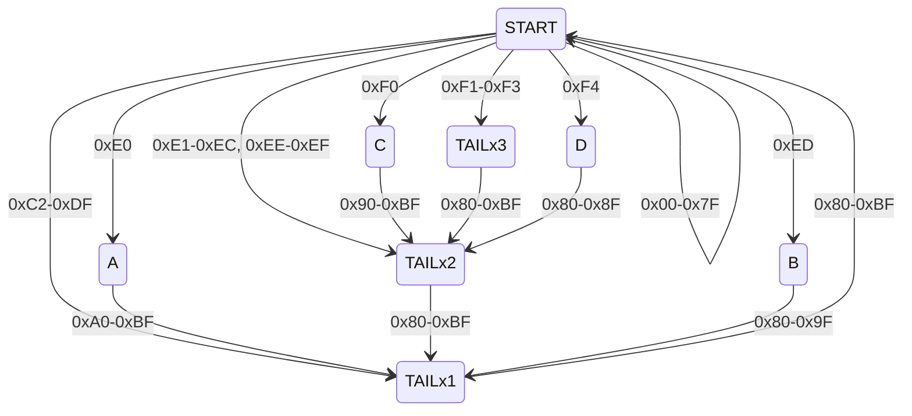

UTF-8は今日の文字エンコーディングの中で最も重要なものと言って差し支えないでしょう。UTF-8の仕様はこの辺で確認できます：

* [Unicode 15.1.0](https://www.unicode.org/versions/Unicode15.1.0/) &gt; 3.9 UTF-8
* [RFC 3629 - UTF-8, a transformation format of ISO 10646](https://datatracker.ietf.org/doc/html/rfc3629)

この記事では、読者はすでにUTF-8にある程度の馴染みがあるものとして、UTF-8のバリデーションの細かいところを考えます。

UTF-8のバリデーションを行うには、以下のことを確かめなければなりません：

* 最初の1バイトが所定の範囲にあること：ASCII (0x00-0x7F) または0xC2以上。
* 後続のバイト（たち）が0x80-0xBFの範囲にあること。
* 長すぎないこと：U+007F以下の文字はちょうど1バイトで表現されていること、U+0080以上U+07FF以下の文字はちょうど2バイトで表現されていること、U+0800以上U+FFFF以下の文字はちょうど3バイトで表現されていること、U+10000以上U+10FFFF以下の文字はちょうど4バイトで表現されていること。
* Unicodeスカラー値として正当な文字を表現していること：サロゲート（U+D800以上U+DFFF以下）や、U+110000以上の値をエンコードしないこと。
    * 当初のUTF-8では31ビット（U+7FFFFFFFまで）表現できましたが、その後縮小されました。

つまり、UTF-8の1文字に相当するパターンは素朴に考えると

```
0x00-0x7F
0xC0-0xDF 0x80-0xBF                      (0b110a aaaa  0b10bb bbbb)
0xE0-0xEF 0x80-0xBF 0x80-0xBF            (0b1110 aaaa  0b10bb bbbb  0b10cc cccc)
0xF0-0xF7 0x80-0xBF 0x80-0xBF 0x80-0xBF  (0b1111 0aaa  0b10bb bbbb  0b10cc cccc  0b10dd dddd)
```

ですが、このパターンでは緩すぎて、不正なUTF-8を受け付けてしまうのです。

このパターンをどう改良すれば良いのか、見ていきます。結果だけ知りたい人は「まとめ」に飛ぶか、Unicodeの規格なりRFC 3629なりを参照してください。

## 2バイトのケース

2バイトのケースでは11ビット、つまりU+07FFまでを表現できます。しかし、U+007F以下の文字は1バイトでエンコードしなくてはならないため、それらに相当する2バイトのパターンは不正となります。

U+0080に相当する表現は

```
0xC2 0x80  (0b1100 0010  0b1000 0000)
```

なので、2バイトの場合はエンコードされたものがこれ以上なら問題ありません。つまり、正しい2バイトのパターンは

```
0xC2-0xDF 0x80-BF
```

となります。

## 3バイトのケース

3バイトのケースでは16ビット、つまりU+FFFFまでを表現できます。しかし、U+07FF以下の文字は2バイト以下でエンコードしなくてはならないので、それらに相当する3バイトのパターンは不正となります。

また、U+D800以上U+DFFF以下のを表現するパターンも不正となります。

U+0800に相当する表現は

```
0xE0 0xA0 0x80  (0b1110 0000  0b1010 0000  0b1000 0000)
```

U+D7FFに相当する表現は

```
0xED 0x9F 0xBF  (0b1110 1101  0b1001 1111  0b1011 1111)
```

U+D800に相当する表現は

```
0xED 0xA0 0x80  (0b1110 1101  0b1010 0000  0b1000 0000)
```

U+DFFFに相当する表現は

```
0xED 0xBF 0xBF  (0b1110 1101  0b1011 1111  0b1011 1111)
```

U+E000に相当する表現は

```
0xEE 0x80 0x80  (0b1110 1110  0b1000 0000  0b1000 0000)
```

となります。複雑なので、パターンを記述する上では1バイト目で分岐するのが良いでしょう。

```
0xE0      0xA0-0xBF 0x80-0xBF
0xE1-0xEC 0x80-0xBF 0x80-0xBF
0xED      0x80-0x9F 0x80-0xBF
0xEE-0xEF 0x80-0xBF 0x80-0xBF
```

## 4バイトのケース

4バイトのケースでは21ビット、つまりU+1FFFFFまでを表現できます。しかし、U+FFFF以下の文字は3バイト以下でエンコードしなくてはならないので、それらに相当する4バイトのパターンは不正となります。

また、U+110000以上の表現するパターンも不正となります。

U+10000に相当する表現は

```
0xF0 0x90 0x80 0x80  (0b1111 0000  0b1001 0000  0b1000 0000  0b1000 0000)
```

U+10FFFFに相当する表現は

```
0xF4 0x8F 0xBF 0xBF  (0b1111 0100  0b1000 1111  0b1011 1111  0b1011 1111)
```

なので、4バイトの正しいパターンは次のようになります。

```
0xF0      0x90-0xBF 0x80-0xBF 0x80-0xBF
0xF1-0xF3 0x80-0xBF 0x80-0xBF 0x80-0xBF
0xF4      0x80-0x8F 0x80-0xBF 0x80-0xBF
```

## まとめ

正しくUTF-8エンコードされた文字は次の形をしており、逆に次の形のバイト列は正しくエンコードされたUTF-8です。

```
0x00-0x7F
0xC2-0xDF 0x80-BF
0xE0      0xA0-0xBF 0x80-0xBF
0xE1-0xEC 0x80-0xBF 0x80-0xBF
0xED      0x80-0x9F 0x80-0xBF
0xEE-0xEF 0x80-0xBF 0x80-0xBF
0xF0      0x90-0xBF 0x80-0xBF 0x80-0xBF
0xF1-0xF3 0x80-0xBF 0x80-0xBF 0x80-0xBF
0xF4      0x80-0x8F 0x80-0xBF 0x80-0xBF
```

## 有限状態機械での表現

有限状態機械としては、8つの状態で表現できます：



各バイトがどの遷移を引き起こすかも書いておきます:

```
0x00-0x7F: START --> START
0x80-0x8F: TAILx1 --> START
           TAILx2 --> TAILx1
           TAILx3 --> TAILx2
           B --> TAILx1
           D --> TAILx2
0x90-0x9F: TAILx1 --> START
           TAILx2 --> TAILx1
           TAILx3 --> TAILx2
           B --> TAILx1
           C --> TAILx2
0xA0-0xBF: TAILx1 --> START
           TAILx2 --> TAILx1
           TAILx3 --> TAILx2
           A --> TAILx1
           C --> TAILx2
0xC2-0xDF: START --> TAILx1
0xE0:      START --> A
0xE1-0xEC: START --> TAILx2
0xED:      START --> B
0xEE-0xEF: START --> TAILx2
0xF0:      START --> C
0xF1-0xF3: START --> TAILx3
0xF4:      START --> D
```
